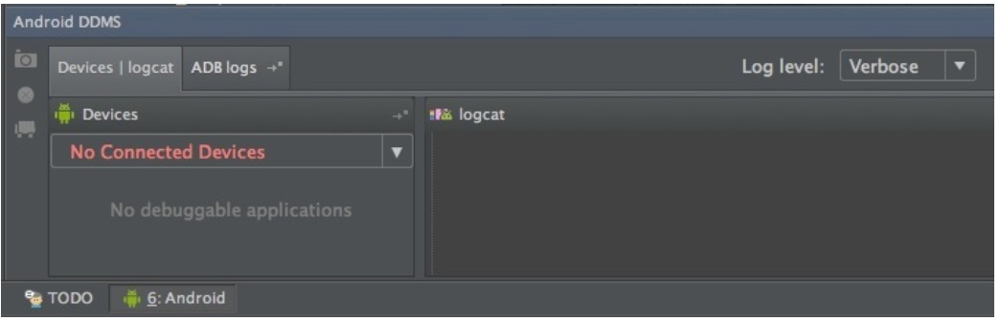
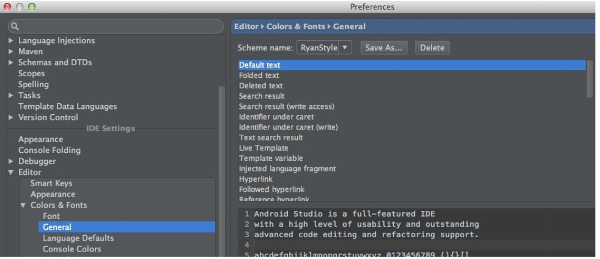

# Android Studio窗口布局及主题介绍

主界面底部有一个名为Android的选项卡，打开可以看到DDMS中的设备信息和Logcat输出：

顶部工具栏中可以看到和Eclipse中功能一样的一个选项，这些相信大家都比较熟悉了：

最后需要说明的是，大家看到我的主界面是暗色风格，和Google演示的是一样的风格，大家第一次使用打开的是默认风格（亮色），如果想要修改的话，进入Preferences（按Command+，）到IDE Settings下选择Colors&font并设置Schema name为Darcula就可以设置成暗色风格，如果需要自己定义样式，比如字体大小颜色等，可以新建一个Schema来自己定义

